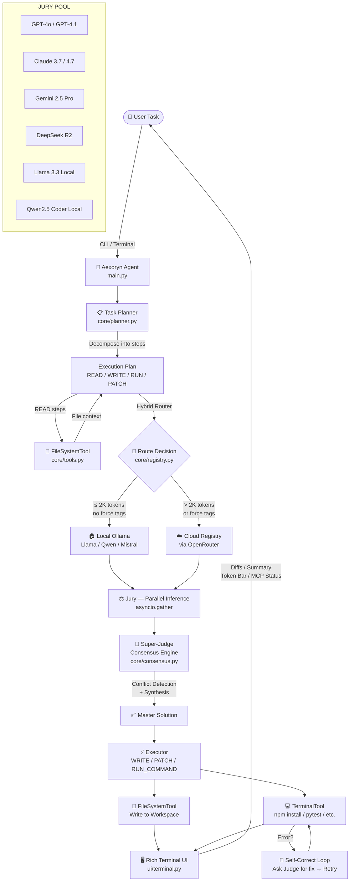

# Aexoryn Agent

**Autonomous Multi-Model Coding Agent — OpenCode-Inspired, Terminal-Native**

> Copyright (c) 2026 Irfan Syazwan / Aexoryn — MIT License

---

## Architecture Flow



---

## Features

| Feature | Description |
|---|---|
| **Multi-Model Jury** | Parallel inference across 366 models — GPT, Claude, Gemini, DeepSeek, Llama, Qwen |
| **Super-Judge Consensus** | Judge model synthesises all jury outputs into one Master Solution |
| **Model Profiles** | `fast` / `turbo` / `balanced` / `premium` presets to control speed vs quality |
| **Multi-File Output** | Agent writes multiple files at once using `=== FILE: path ===` format |
| **Self-Improving Loop** | Runs tests automatically after writing code; fixes and retries up to 3× |
| **Long-Term Memory** | Recalls relevant past solutions as context across sessions |
| **Chat / Interactive Mode** | REPL with conversation history — follow up, refine, iterate |
| **Auto-Read Workspace** | Scans workspace files for relevant context before calling the jury |
| **Diff Preview** | Shows colored diff and asks confirmation before overwriting any file |
| **Token Budget Guard** | Warns at 50K tokens; hard stops at 500K to prevent runaway credit spend |
| **Task History** | Every task auto-saved to `logs/history.json` — browse with `history` command |
| **Hybrid Routing** | Routes simple tasks to local Ollama; complex tasks to cloud |
| **Plug-and-Play Registry** | Add any model in `model_config.yaml` — no code changes needed |
| **Self-Correction** | Failed commands sent back to judge model for auto-fix and retry |
| **Rich Terminal UI** | Live spinners, jury tables, visual diffs, token progress bar |
| **Ollama Support** | Free local inference — no API key, no credits, no rate limits |

---

## Quick Start

```bash
# 1. Clone & install
git clone https://github.com/aexoryn-code/Aexoryn-Agent
cd Aexoryn-Agent
pip install -r requirements.txt

# 2. Configure
cp .env.example .env
# Edit .env → add your OPENROUTER_API_KEY

# 3. Run your first task
python main.py run "Create a login page in HTML"

# Use a profile to control speed vs quality
python main.py run --profile fast   "Fix syntax error in utils.py"   # 1 model, instant
python main.py run --profile balanced "Create a REST API in Flask"    # 15 free models
python main.py run --profile premium  "Architect a microservice"      # 50 top models

# Auto-apply without confirmation prompt
python main.py run --yes --workspace ./my-project "Add dark mode to App.tsx"

# Interactive chat mode with memory
python main.py chat --workspace ./my-project

# View all commands & options
python main.py --help
python main.py run --help
```

### Free — No API Key Required (Ollama)
```bash
# Install Ollama from https://ollama.com, then pull a model:
ollama pull llama3.2

# Register with Aexoryn and run
python main.py setup-ollama
python main.py run --profile fast "your task"
```

---

## Adding a New Model

Open `model_config.yaml` and add an entry under `models:`:

```yaml
- id: gpt-5.2-preview          # Unique ID used internally
  name: GPT-5.2 Preview         # Display name
  provider: openrouter          # openrouter | litellm | ollama
  model_path: openai/gpt-5.2-preview   # Provider model string
  tier: cloud                   # cloud | local
  enabled: true                 # Toggle without removing the entry
  weight: 1.8                   # Jury consensus weight (0.0 – 2.0)
  strengths: [reasoning, architecture, meta_cognition]
  max_tokens: 32768
  temperature: 0.1
```

Then hot-reload:

```bash
python main.py --reload-config "your task"
# or
python main.py reload-config
```

No code changes required. The registry loads the YAML at runtime.

---

## Project Structure

```
aexoryn-agent/
├── main.py                  # CLI entry point (Typer) — all commands
├── model_config.yaml        # Plug-and-Play model registry
├── requirements.txt
├── .env.example             # Copy to .env and add your API key
├── LICENSE                  # MIT 2026
│
├── core/
│   ├── registry.py          # ModelRegistry + profiles + hybrid router + budget guard
│   ├── consensus.py         # Super-Judge / majority_vote / weighted_rank
│   ├── planner.py           # TaskPlanner — plan, jury, consensus, write, self-improve
│   ├── memory.py            # Long-term memory store (keyword-based recall)
│   └── tools.py             # FileSystemTool + TerminalTool + DiffTool
│
├── scripts/
│   ├── fetch_models.py      # Fetch & register cloud models from OpenRouter
│   └── setup_ollama.py      # Discover & register local Ollama models
│
├── ui/
│   └── terminal.py          # Rich terminal UI — banner, logs, diffs, summary, budget
│
└── logs/                    # Auto-created at runtime (gitignored)
    ├── session.log          # Full session log
    ├── history.json         # Task history (browsable via `history` command)
    └── memory.json          # Long-term memory store
```

---

## Consensus Modes

| Mode | Description |
|---|---|
| `super_judge` | All jury responses are fed to the judge model, which writes the final Master Solution. Highest quality. |
| `majority_vote` | Most common response snippet wins. Fast and cost-efficient. |
| `weighted_rank` | Highest-weight model's response is returned directly. Fastest. |

Change mode in `model_config.yaml` under `consensus.mode`, or override per-run:

```bash
python main.py --mode majority_vote "task"
```

---

## Hybrid Routing

```yaml
hybrid_routing:
  local_threshold_tokens: 2000       # Tasks under 2K tokens → Ollama
  cloud_force_tags: [reasoning, architecture, security, consensus]
```

Tasks tagged with force tags **always** go to cloud, regardless of token count.
Local routing requires at least one enabled `tier: local` model.

---

## Environment Variables

| Variable | Description |
|---|---|
| `OPENROUTER_API_KEY` | Required for cloud models via OpenRouter |
| `OLLAMA_BASE_URL` | Ollama endpoint (default: `http://localhost:11434`) |
| `AEXORYN_WORKSPACE` | Default workspace path |
| `AEXORYN_LOG_LEVEL` | `DEBUG` / `INFO` / `WARNING` |
| `AEXORYN_SESSION_LOG` | Log file path |

---

## License

MIT License — Copyright (c) 2026 Irfan Syazwan / Aexoryn.
See [LICENSE](LICENSE) for full text.
